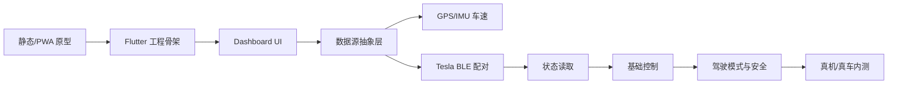

# App 开发执行规划 — T-Dash

| 字段 | 内容 |
| --- | --- |
| 文档版本 | v0.1 |
| 创建日期 | 2026-04-27 |
| 最后更新 | 2026-04-27 |
| 状态 | 执行草案 |
| 输入文档 | `01-PRD-产品需求文档.md`、`02-技术架构与选型.md`、`04-UI-UX设计原则.md` |
| 当前范围 | App 开发、原型验证、真机测试 |

## 1. 执行目标

本规划把产品需求、技术架构、UI/UX 原则收敛为可执行开发路线。当前阶段不以上架、商业化、合规材料为主目标，优先把 App 本体做出来：能配对、能连接、能显示、能控制、能在车内安全使用。

### 1.1 v1 目标

v1 是纯软件近场 App：

- 使用 Tesla 官方 BLE 作为车辆近场通信路径。
- 使用手机 GPS/IMU 做车速显示，并诚实标注数据源。
- 所有车辆数据、位置数据、本地偏好都在设备端处理。
- 提供车内第二屏仪表盘、基础状态查看和基础控制。
- 驾驶中自动进入驾驶模式，隐藏或禁用控制能力。

### 1.2 当前开发原则

- 先做可跑版本，再补完整工程化。
- 先做模拟数据与 UI 原型，再接真实 BLE/GPS。
- 先打通最小闭环，再扩展细节页面。
- 任何控制类能力都必须受驾驶模式约束。
- UI 层只消费抽象数据，不直接绑定 GPS/BLE/CAN 具体来源。

### 1.3 暂不处理

- App Store / 华为 / 小米上架材料。
- 商标、软著、备案、合规专项。
- 远程查车、远程控车、云账号系统。
- v2 OBD 适配器硬件供应链。
- 行程轨迹、能耗历史、驾驶报告。

## 2. 总体路线

路线分两条并行推进：

- **体验线**：PWA 原型 → Flutter UI → 横竖屏适配 → 驾驶模式 → 状态/错误反馈。
- **能力线**：状态模型 → Provider 抽象 → GPS/IMU → BLE 配对 → 状态读取 → 命令控制。

两条线通过统一的 `VehicleState`、`VelocityProvider`、`VehicleDataProvider`、`ControlCommandService` 汇合。

## 3. 里程碑

### M0：原型与工程准备

周期：W0-W1

目标：

- 明确 v1 App 开发范围。
- 建立可演示仪表盘原型。
- 准备 Flutter 开发环境与工程结构。
- 固化数据模型和 Provider 接口草案。

交付物：

- `app/` PWA 原型，可直接打开体验主仪表盘。
- Flutter 工程初始化方案。
- App 模块目录结构。
- 初版 `VehicleState` / `VelocitySample` / `PairingInfo` 数据模型。

验收标准：

- 原型能展示速度、电量、续航、锁车、空调、胎压、充电状态。
- 原型能模拟驾驶模式，并在行驶中隐藏控制按钮。
- 开发环境能运行 `flutter doctor`、`flutter analyze`、`flutter test`。
- README 写清楚本地启动方式。

### M1：Flutter 骨架与设计系统

周期：W1-W2

目标：

- 创建 Flutter App 工程。
- 落地基础路由、状态管理、主题 token。
- 把 PWA 原型中的主仪表盘迁到 Flutter。

交付物：

- `lib/main.dart`、`lib/app.dart`。
- Riverpod Provider 初始化。
- `go_router` 路由：首页、配对页、控制页、设置页占位。
- 深色主题 token：背景、文字、强调、警告、危险、描边。
- Dashboard 静态 UI。

验收标准：

- iOS/Android 模拟器至少一个平台能启动。
- Dashboard 页面在常见手机尺寸下不溢出。
- 车速是视觉中心，1 秒内可识别。
- 控制按钮触摸目标不小于 48dp。
- `flutter analyze` 无 error。

### M2：状态层与模拟数据闭环

周期：W2-W3

目标：

- 将 UI 从具体数据源解耦。
- 用模拟 Provider 完整跑通仪表盘和控制逻辑。
- 为真实 GPS/BLE 接入留好接口。

交付物：

- Domain 层实体：
  - `VehicleState`
  - `VelocitySample`
  - `PairingInfo`
  - `ProviderHealth`
- Provider 接口：
  - `VelocityProvider`
  - `VehicleDataProvider`
  - `ControlCommandService`
- Mock 实现：
  - `MockVelocityProvider`
  - `MockVehicleDataProvider`
  - `MockControlCommandService`
- Dashboard ViewModel。

验收标准：

- UI 不直接调用 GPS/BLE/模拟源。
- 切换模拟状态后 UI 自动响应。
- 行驶中控制命令被拒绝并显示提示。
- 单元测试覆盖 Provider 切换、ViewModel 文案、驾驶模式禁用逻辑。

## 4. 核心功能执行拆解

### 4.1 配对与连接

目标：

- 完成 Tesla BLE 配对流程。
- 生成并安全保存 P-256 私钥。
- 引导用户在车机上确认配对。
- 支持配对失败、重试、凭证失效、重新配对。

任务：

1. 阅读 Tesla `vehicle-command` 官方源码和 protobuf 定义。
2. 确认 BLE 服务 UUID、写特征、通知特征、分片策略。
3. 实现 `KeyPairService`。
4. 实现 `SecureStore`，私钥写入 Keychain / Keystore。
5. 实现 `BleScanner`。
6. 实现 `BleGattClient`。
7. 实现 `PairingService`。
8. 实现配对页 UI：扫描、连接、等待车机确认、成功、失败。
9. 实现凭证失效检测和重新配对流程。

验收标准：

- 无真车时可用模拟器跑完整配对状态机。
- 有真车时可完成一次真实 BLE 配对。
- 私钥不进入日志、不进入普通本地数据库。
- 卸载/清数据后进入重新配对引导。

风险：

- BLE 权限在 Android/iOS 差异较大。
- Tesla 协议细节可能需要读官方 Go SDK。
- 真车调试资源是关键依赖。

### 4.2 仪表盘主页

目标：

- 做出 v1 核心体验页面。
- 车内强光、夜间、横竖屏都可读。
- 信息层级保持“车速第一、电量第二、状态第三、控制第四”。

任务：

1. 实现 `DashboardPage`。
2. 实现 `SpeedGauge`。
3. 实现 `BatteryRangePanel`。
4. 实现 `VehicleVisualStatus`。
5. 实现 `StatusCardGrid`。
6. 实现底部 `QuickControlBar`。
7. 适配横屏布局。
8. 适配小屏设备。
9. 增加 loading、empty、degraded、offline 状态。

验收标准：

- 竖屏主视觉不需要滚动即可看到速度、电量、核心状态和控制区。
- 横屏模式下控制区和主仪表不互相遮挡。
- 速度、单位、数据源文案不会换行错位。
- GPS 弱信号、BLE 断开、未配对时都有明确状态。

### 4.3 GPS/IMU 车速

目标：

- v1 使用手机 GPS 作为速度主来源。
- 使用 IMU 平滑低频 GPS 更新。
- 明确标注 `GPS`，不冒充车机车速。

任务：

1. 接入 `geolocator`。
2. 接入 `sensors_plus`。
3. 实现 `GpsVelocityProvider`。
4. 实现基础速度平滑。
5. 实现 EKF 版本算法。
6. 实现健康状态：healthy / degraded / unavailable。
7. 实现 GPS 弱信号 UI。
8. 编写模拟轨迹测试。

验收标准：

- 静止状态速度稳定归零。
- GPS 无信号超过 10 秒显示“信号弱”。
- 常规道路测试中速度显示不明显乱跳。
- 算法单元测试覆盖匀速、加速、刹车、GPS 丢失。

### 4.4 车辆状态读取

目标：

- 通过 BLE 获取车辆基础状态。
- 状态流统一进入 `VehicleStateNotifier`。

任务：

1. 梳理 v1 必需字段：电量、续航、锁、门窗、空调、充电、胎压。
2. 实现 protobuf 生成流程。
3. 实现 `GetVehicleData` 请求。
4. 实现响应解析。
5. 将 BLE 原始状态映射为 Domain `VehicleState`。
6. 实现字段缺失时的降级展示。
7. 实现 BLE 心跳刷新。

验收标准：

- 已连接车辆时能读取至少电量、锁状态、空调状态。
- 字段不可用时 UI 显示“暂不可用”，不崩溃。
- BLE 超时能进入 degraded/offline 状态。
- 状态读取不会阻塞 UI。

### 4.5 基础控制

目标：

- 实现近场 BLE 控制。
- 控制行为必须安全、可反馈、可失败。

P0 控制：

- 解锁 / 上锁。
- 空调启动 / 关闭。
- 空调设定温度。
- 闪灯。
- 前备箱 / 后备箱开启。
- 充电口开 / 关。
- 哨兵模式开 / 关。

任务：

1. 实现命令签名。
2. 实现 counter / epoch / 防重放参数。
3. 实现命令发送和响应监听。
4. 实现按钮 loading 状态。
5. 实现命令失败分类：范围外、未配对、超时、车辆拒绝、未知错误。
6. 对鸣笛、解锁、备箱类命令增加长按或二次确认。
7. 行驶中禁用全部控制命令。

验收标准：

- 停车状态下命令有明确成功/失败反馈。
- 行驶状态下控制命令不会发出。
- 超时后按钮恢复可操作并提示重试。
- 控制失败不会导致状态错乱。

### 4.6 驾驶模式

目标：

- 车辆运动中自动进入驾驶模式。
- 减少分心和误触。

触发策略：

- 速度 > 5 km/h 持续 3 秒进入驾驶模式。
- 速度 < 1 km/h 持续 5 秒退出驾驶模式。
- 加速度计作为辅助判定。

任务：

1. 实现 `DrivingModeDetector`。
2. 接入 `VelocityProvider`。
3. 驾驶中隐藏或禁用控制条。
4. 驾驶中禁用设置、配对、详情页跳转。
5. 增加进入/退出驾驶模式提示。
6. 真车测试后调参。

验收标准：

- 路口短暂停车不会频繁切换。
- 行驶中所有控制按钮不可用。
- 停车后控制区自动恢复。
- 用户关闭驾驶模式开关时，高风险命令仍保留二次确认。

### 4.7 设置与本地存储

目标：

- 提供基础设置能力。
- 所有数据本地保存。

任务：

1. 设置页：单位、主题、车速来源、车辆配对、隐私说明、清除数据。
2. `flutter_secure_storage` 保存私钥和数据库密钥。
3. Isar 或 Drift 保存偏好、车辆昵称、配对记录。
4. 实现数据清除和解绑。
5. 实现设置变更后即时刷新 UI。

验收标准：

- 切换单位后速度/续航/胎压单位同步更新。
- 清除数据后 App 回到首次启动流程。
- 敏感数据不出现在普通本地存储。

## 5. 周计划

### W0：当前原型收口

- 完成 PWA 仪表盘原型。
- 修复基础 review 问题。
- 整理状态层、模拟 Provider、ViewModel。
- 记录当前 UI 决策和待迁移点。

### W1：Flutter 环境与工程

- 安装 Flutter / Android Studio / Xcode 或等效工具链。
- 创建 `t_dash` Flutter 工程。
- 接入 Riverpod、go_router、基础主题。
- 搭建目录结构。
- 建立 CI 最小脚本：analyze + test。

### W2：Dashboard UI 迁移

- 迁移主仪表盘布局。
- 实现底部控制条。
- 实现横竖屏适配。
- 实现基础状态卡片。
- 加入 widget 测试。

### W3：Domain 与 Mock Provider

- 定义 Domain 实体和接口。
- 实现 Mock 数据源。
- 实现 ViewModel。
- 跑通模拟驾驶、锁车、空调、闪灯。
- 补单元测试。

### W4：GPS 车速第一版

- 接入定位权限。
- 获取 GPS 速度。
- 实现静止归零、弱信号、数据源标注。
- 用模拟轨迹测试速度显示。
- 真机路测一轮。

### W5：IMU 与驾驶模式

- 接入加速度计和陀螺仪。
- 实现基础融合或平滑算法。
- 实现驾驶模式检测。
- 行驶中隐藏控制和禁用导航。
- 真机调参。

### W6：BLE 扫描与权限

- 接入 BLE 插件。
- 实现权限请求。
- 扫描附近车辆 BLE 广播。
- 建立连接和断开重连框架。
- 梳理 iOS/Android 权限差异。

### W7-W8：配对协议 PoC

- 生成 P-256 密钥对。
- 保存私钥。
- 实现 AddKey 请求。
- 监听车辆响应。
- 完成真车配对尝试。
- 写配对失败处理。

### W9-W10：车辆状态读取

- 接入 protobuf。
- 实现 `GetVehicleData`。
- 解析基础状态字段。
- 状态流进入 Dashboard。
- 处理字段缺失和 BLE 断开。

### W11-W12：基础控制

- 实现命令签名。
- 实现锁车/解锁。
- 实现空调开关。
- 实现闪灯。
- 实现命令 loading、成功、失败状态。
- 行驶中禁用真实命令。

### W13-W14：详情页与设置页

- 控制页完善。
- 胎压详情页。
- 充电详情页。
- 设置页。
- 解绑和清除数据。

### W15-W16：内测准备

- 5 款主流手机测试。
- 1-2 辆 Model 3/Y 真车测试。
- 修复 BLE 兼容性。
- 修复 UI 溢出和横屏问题。
- 建立 bug 列表和优先级。

### W17-W20：稳定化

- 完善错误文案。
- 增加日志开关。
- 增加崩溃监控方案，若只本地测试可先跳过。
- 优化启动速度、内存、耗电。
- 补关键单元测试和 widget 测试。

### W21-W24：v1 候选版

- 冻结 P0 功能。
- 做回归测试。
- 输出安装包。
- 组织小范围真实用户试用。
- 决策是否继续上架、是否进入 v1.5 或 v2 预研。

## 6. 模块优先级

| 优先级 | 模块 | 原因 |
| --- | --- | --- |
| P0 | Dashboard 主界面 | 产品第一体验 |
| P0 | 数据源抽象层 | 决定 v1/v2 可演进性 |
| P0 | GPS 速度 | v1 仪表盘核心数据 |
| P0 | 驾驶模式 | 安全底线 |
| P0 | BLE 配对 | 车辆能力入口 |
| P0 | 基础状态读取 | 仪表盘真实性 |
| P0 | 基础控制 | 近场价值主张 |
| P1 | 控制详情页 | 提升可用性 |
| P1 | 设置页 | 必需但可简化 |
| P1 | 重新配对 | 真机使用必遇到 |
| P2 | 主题切换 | 体验增强 |
| P2 | 充电曲线 | v1 可后置 |
| P2 | 多车支持 | v1 不做 |
| P3 | CarPlay / Android Auto | v1 不做 |

## 7. 验收总表

| 能力 | 最低验收 |
| --- | --- |
| 启动 | 2.5 秒内进入可交互主页或配对页 |
| 仪表盘 | 速度、电量、续航、状态、控制清晰可见 |
| GPS 速度 | 静止归零，弱信号降级，数据源明确标注 |
| 驾驶模式 | 行驶中隐藏控制按钮并阻止控制命令 |
| BLE 配对 | 可完成至少一次真车配对 |
| 状态读取 | 能读取并展示基础车辆状态 |
| 基础控制 | 停车时可执行 P0 命令，失败有提示 |
| 本地存储 | 私钥安全保存，普通偏好可恢复 |
| 错误处理 | 用户知道问题原因和下一步操作 |
| 测试 | 关键 Domain 逻辑有单元测试，Dashboard 有 widget 测试 |

## 8. 测试计划

### 8.1 单元测试

覆盖：

- `VelocityProviderSelector`
- `DrivingModeDetector`
- EKF / 速度平滑算法
- 命令签名输入输出
- Provider health 状态转换
- Dashboard ViewModel 文案
- 设置项单位转换

### 8.2 Widget 测试

覆盖：

- 仪表盘默认状态。
- GPS 弱信号状态。
- BLE 断开状态。
- 驾驶模式状态。
- 命令 loading / success / failed。
- 小屏文字不溢出。

### 8.3 集成测试

覆盖：

- 首次启动 → 配对引导 → 配对成功 → 主仪表盘。
- 主仪表盘 → 控制 → 成功反馈。
- GPS 运动 → 驾驶模式 → 禁用控制。
- 清除数据 → 回到首次启动。

### 8.4 真机/真车测试

最低组合：

- iPhone 近两代机型各 1 台。
- Android 主流品牌至少 3 台。
- Model 3 或 Model Y 至少 1 辆。
- 场景：地库、露天停车场、市区道路、高速或快速路、充电场景。

重点观察：

- BLE 扫描速度。
- 配对成功率。
- 命令响应延迟。
- GPS 车速稳定性。
- 手机发热与耗电。
- 横竖屏可读性。

## 9. 关键决策点

| 决策点 | 截止时间 | 推荐判断方式 |
| --- | --- | --- |
| Isar vs Drift | W2 | 看 Isar 4 稳定性和生成代码体验 |
| BLE 插件选择 | W6 | 优先 `flutter_reactive_ble`，若兼容性差再评估 `flutter_blue_plus` |
| Tesla BLE 协议覆盖范围 | W7 | 先配对 + 状态读取 + 3 个控制命令 |
| GPS 融合算法复杂度 | W5 | 先平滑，EKF 仅在抖动明显时加 |
| 崩溃监控是否接入 | W17 | 仅自测可不接，内测扩大后再接 |
| 是否进入 v2 OBD 预研 | v1 内测后 | 看用户对真实车速/能耗的反馈 |

## 10. 风险与应对

| 风险 | 影响 | 应对 |
| --- | --- | --- |
| Tesla BLE 协议实现难度超预期 | M1-M3 延误 | 先做协议 PoC，不等 UI 全部完成 |
| 无真车长期测试 | BLE/命令不可验证 | W3 前确定真车资源 |
| GPS 车速体验不稳定 | 仪表盘核心受损 | 诚实标注、弱信号降级、必要时简化成“辅助速度” |
| Flutter BLE 插件兼容性 | 部分手机不可用 | 建立设备矩阵，必要时原生通道兜底 |
| 驾驶中误触 | 安全风险 | 驾驶模式 P0，不允许后置 |
| 单人开发范围失控 | 进度风险 | v1 只保留 P0，P1/P2 全部可砍 |

## 11. 开发工作流

### 11.1 每个功能的执行顺序

1. 写 Domain 接口和状态模型。
2. 写 Mock Provider。
3. 写 UI 和 ViewModel。
4. 写真实 Provider。
5. 写错误/降级状态。
6. 写测试。
7. 真机验证。

### 11.2 Definition of Done

一个功能只有同时满足这些条件才算完成：

- UI 能在模拟数据下稳定工作。
- 真实能力接入或已明确标记为 mock。
- 错误状态有用户可读文案。
- 行驶中安全限制生效。
- 至少有单元测试或 widget 测试覆盖关键逻辑。
- 不引入未解释的敏感权限。

### 11.3 代码组织原则

- `domain/` 不依赖 Flutter，不依赖 BLE/GPS 插件。
- `infrastructure/` 放真实 GPS、BLE、存储、协议实现。
- `presentation/` 只消费 ViewModel。
- 控制命令必须经过统一 service，不能在按钮回调里直连 BLE。
- 所有数据源必须报告 `ProviderHealth`。

## 12. 当前立即任务

按照当前仓库状态，下一轮建议这样做：

1. 保留 `app/` PWA 原型，继续作为 UI 快速试验场。
2. 增加 `README.md`，写清楚原型打开方式和项目目标。
3. 创建 `docs/06-数据模型与接口草案.md`，先定义 `VehicleState`、`VelocityProvider`、`ControlCommandService`。
4. 安装 Flutter 工具链后创建 `t_dash/` 工程。
5. 把 PWA 中已验证的 Dashboard 迁移为 Flutter 页面。

优先级最高的第一批代码任务：

- Dashboard 组件拆分。
- Mock Vehicle Provider。
- Driving Mode Detector。
- GPS Velocity Provider。
- BLE 配对 PoC。

## 13. 变更记录

| 版本 | 日期 | 变更 |
| --- | --- | --- |
| v0.1 | 2026-04-27 | 根据 PRD、技术架构、UI/UX 三份文档生成 App 开发执行规划 |
