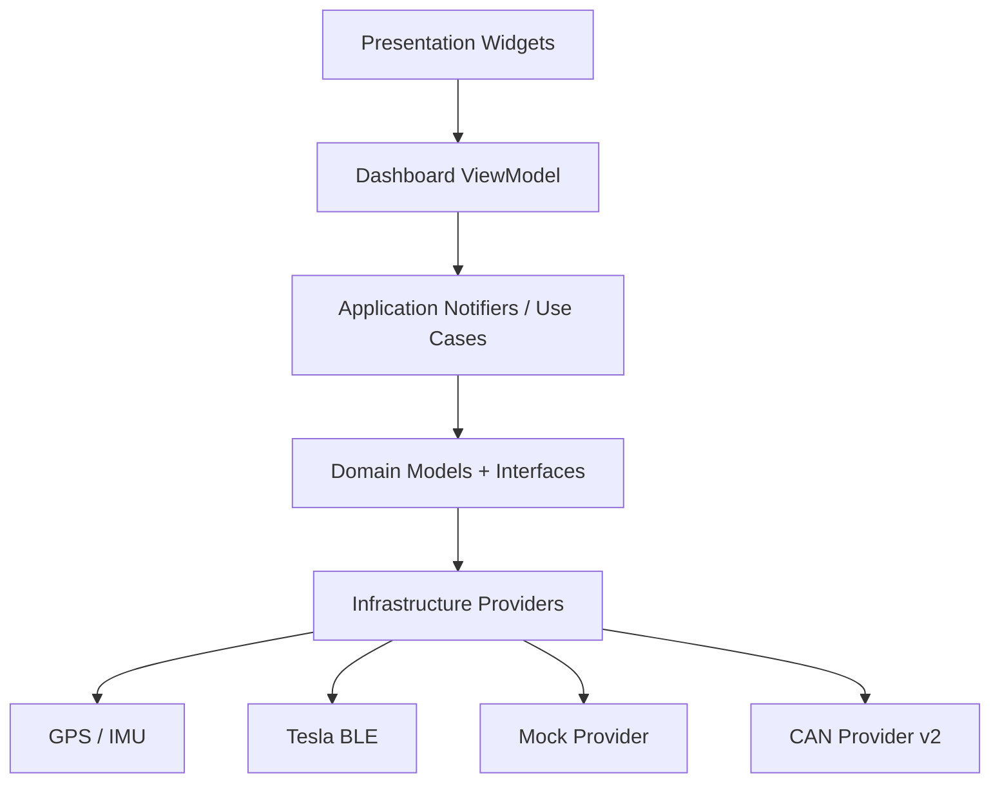

# 数据模型与接口草案 — T-Dash

| 字段 | 内容 |
| --- | --- |
| 文档版本 | v0.1 |
| 创建日期 | 2026-04-28 |
| 最后更新 | 2026-04-28 |
| 状态 | 草案 |
| 适用范围 | v1 App 开发 |

## 1. 目标

本文定义 T-Dash v1 的核心数据模型和接口边界，作为 PWA 原型迁移到 Flutter 工程时的实现依据。

设计目标：

- UI 不直接依赖 GPS、BLE、CAN 或 Mock 数据源。
- 真实数据与模拟数据使用同一套 Domain 模型。
- 驾驶模式、控制命令、错误提示都经过统一状态流。
- v1 使用 GPS + BLE，v2 可增加 CAN Provider，不推翻上层 UI。

## 2. 分层边界



边界规则：

- `presentation/` 只消费 ViewModel，不直接调用插件。
- `domain/` 只放实体和接口，不依赖 Flutter。
- `application/` 负责组合 Provider、状态机和业务规则。
- `infrastructure/` 才接入 GPS、BLE、存储、协议和硬件。

## 3. 枚举定义

### 3.1 连接状态

```dart
enum VehicleConnectionStatus {
  unpaired,
  scanning,
  connecting,
  connected,
  degraded,
  disconnected,
  outOfRange,
  credentialInvalid,
}
```

说明：

- `unpaired`：从未配对。
- `scanning`：正在扫描车辆。
- `connected`：BLE 可用。
- `degraded`：连接存在但数据不完整或延迟高。
- `credentialInvalid`：私钥丢失、签名失败或车辆拒绝。

### 3.2 Provider 健康状态

```dart
enum ProviderHealth {
  healthy,
  degraded,
  unavailable,
}
```

说明：

- `healthy`：数据新鲜且可信。
- `degraded`：数据可用但需要 UI 标注风险。
- `unavailable`：不可用于当前展示或控制。

### 3.3 速度来源

```dart
enum VelocitySource {
  gps,
  fusedGpsImu,
  canBus,
  mock,
}
```

v1 默认使用 `gps` 或 `fusedGpsImu`。v2 接入 OBD 后增加 `canBus`。

### 3.4 充电状态

```dart
enum ChargingState {
  disconnected,
  connected,
  charging,
  complete,
  stopped,
  fault,
  unknown,
}
```

### 3.5 控制命令类型

```dart
enum ControlCommandType {
  lock,
  unlock,
  startClimate,
  stopClimate,
  setClimateTemperature,
  flashLights,
  honk,
  openFrunk,
  openTrunk,
  openChargePort,
  closeChargePort,
  enableSentry,
  disableSentry,
}
```

### 3.6 控制命令状态

```dart
enum CommandStatus {
  queued,
  sending,
  success,
  failed,
  blockedByDrivingMode,
  timeout,
}
```

## 4. 核心实体

### 4.1 VehicleState

`VehicleState` 是仪表盘主状态。UI 不应该读取 BLE 原始消息，而是读取此模型。

```dart
class VehicleState {
  final String? vehicleId;
  final String displayName;
  final VehicleConnectionStatus connectionStatus;
  final DateTime updatedAt;
  final BatteryState battery;
  final DoorLockState locks;
  final ClosureState closures;
  final ClimateState climate;
  final ChargingStatus charging;
  final TirePressureState tirePressure;
  final DrivingModeState drivingMode;
  final ProviderHealth health;
}
```

约束：

- `updatedAt` 必须表示最后一次有效数据更新时间。
- 字段缺失不能抛异常，应该落到 `unknown` 或 `null`。
- `health` 由数据源统一计算，UI 只负责展示。

### 4.2 BatteryState

```dart
class BatteryState {
  final double? stateOfChargePercent;
  final double? ratedRangeKm;
  final double? estimatedRangeKm;
  final ProviderHealth health;
}
```

展示规则：

- 优先展示 `stateOfChargePercent`。
- 续航优先使用项目约定的默认来源，暂定 `ratedRangeKm`。
- 数据缺失时显示 `--`，不显示过期数字。

### 4.3 DoorLockState

```dart
class DoorLockState {
  final bool? locked;
  final ProviderHealth health;
}
```

展示规则：

- `locked == true`：已上锁。
- `locked == false`：已解锁。
- `locked == null`：状态未知。

### 4.4 ClosureState

```dart
class ClosureState {
  final bool? frontLeftDoorOpen;
  final bool? frontRightDoorOpen;
  final bool? rearLeftDoorOpen;
  final bool? rearRightDoorOpen;
  final bool? frunkOpen;
  final bool? trunkOpen;
  final bool? chargePortOpen;
  final bool? anyWindowOpen;
}
```

展示规则：

- 任一开启状态为 `true` 时，主界面展示“有开启项”。
- 全部明确为 `false` 时，展示“全部关闭”。
- 若关键字段缺失，展示“请确认门窗”。

### 4.5 ClimateState

```dart
class ClimateState {
  final bool? isOn;
  final double? insideTempC;
  final double? outsideTempC;
  final double? setTempC;
  final ProviderHealth health;
}
```

展示规则：

- `isOn == true`：运行。
- `isOn == false`：待机。
- 温度缺失时不隐藏空调卡片，只隐藏具体数字。

### 4.6 ChargingStatus

```dart
class ChargingStatus {
  final ChargingState state;
  final double? powerKw;
  final int? minutesToFullCharge;
  final double? chargeLimitPercent;
  final ProviderHealth health;
}
```

展示规则：

- `charging` 展示功率和剩余时间。
- `connected` 但未充电时展示“已连接”。
- `disconnected` 展示“未连接”。
- `fault` 使用警告状态。

### 4.7 TirePressureState

```dart
class TirePressureState {
  final double? frontLeftBar;
  final double? frontRightBar;
  final double? rearLeftBar;
  final double? rearRightBar;
  final ProviderHealth health;
}
```

展示规则：

- 主界面只展示简版，例如 `2.8 / 2.8`。
- 详情页展示四轮。
- 任一低于阈值时使用 warning。

### 4.8 VelocitySample

```dart
class VelocitySample {
  final double kmh;
  final DateTime timestamp;
  final VelocitySource source;
  final double confidence;
  final ProviderHealth health;
}
```

约束：

- `kmh` 不允许为负数。
- `confidence` 范围为 `0.0` 到 `1.0`。
- GPS 弱信号时 `health = ProviderHealth.degraded`。
- 无有效数据时 Provider 应报告 `unavailable`，而不是返回随机速度。

### 4.9 DrivingModeState

```dart
class DrivingModeState {
  final bool active;
  final DateTime? enteredAt;
  final String? reason;
}
```

进入条件：

- 速度大于 5 km/h 持续 3 秒。

退出条件：

- 速度小于 1 km/h 持续 5 秒。

### 4.10 PairingInfo

```dart
class PairingInfo {
  final String vehicleId;
  final String displayName;
  final String publicKeyFingerprint;
  final String? vehicleKeyId;
  final DateTime pairedAt;
  final DateTime? lastConnectedAt;
}
```

安全约束：

- 这里不保存私钥。
- 私钥只能通过 `SecureKeyStore` 读取。
- `publicKeyFingerprint` 可用于 UI 展示和故障排查。

### 4.11 ControlCommandRequest

```dart
class ControlCommandRequest {
  final ControlCommandType type;
  final Map<String, Object?> payload;
  final DateTime createdAt;
  final bool requiresConfirmation;
}
```

约束：

- 高风险命令必须 `requiresConfirmation = true`。
- 行驶中所有车辆控制命令都必须被阻止。

### 4.12 ControlCommandResult

```dart
class ControlCommandResult {
  final CommandStatus status;
  final ControlCommandType type;
  final String userMessage;
  final Object? rawError;
  final DateTime completedAt;
}
```

展示规则：

- UI 只展示 `userMessage`。
- `rawError` 只进入调试日志，不直接暴露给用户。

## 5. Provider 接口

### 5.1 VelocityProvider

```dart
abstract class VelocityProvider {
  Stream<VelocitySample> get velocityStream;
  VelocitySource get source;
  ProviderHealth get health;

  Future<void> start();
  Future<void> stop();
}
```

实现：

- `GpsVelocityProvider`
- `FusedVelocityProvider`
- `MockVelocityProvider`
- `CanVelocityProvider` v2

### 5.2 VehicleDataProvider

```dart
abstract class VehicleDataProvider {
  Stream<VehicleState> get vehicleStateStream;
  ProviderHealth get health;

  Future<void> connect();
  Future<void> disconnect();
  Future<VehicleState> refresh();
}
```

实现：

- `TeslaBleVehicleDataProvider`
- `MockVehicleDataProvider`

### 5.3 ControlCommandService

```dart
abstract class ControlCommandService {
  Future<ControlCommandResult> send(ControlCommandRequest request);
  bool canSend(ControlCommandType type, VehicleState state);
}
```

规则：

- `canSend` 是所有控制按钮启用/禁用的唯一业务依据。
- 行驶中返回 `false`。
- 未配对、连接断开、凭证失效时返回 `false`。

### 5.4 PairingService

```dart
abstract class PairingService {
  Stream<PairingStep> get stepStream;

  Future<void> startPairing();
  Future<void> cancelPairing();
  Future<void> removePairing(PairingInfo pairingInfo);
}
```

`PairingStep` 建议包含：

- 扫描中。
- 找到车辆。
- 正在连接。
- 等待车机确认。
- 配对成功。
- 配对失败。

### 5.5 SecureKeyStore

```dart
abstract class SecureKeyStore {
  Future<void> savePrivateKey(String vehicleId, List<int> privateKey);
  Future<List<int>?> readPrivateKey(String vehicleId);
  Future<void> deletePrivateKey(String vehicleId);
}
```

实现约束：

- iOS 使用 Keychain。
- Android 使用 Keystore。
- 禁止将私钥写入普通数据库、日志或崩溃上报。

## 6. Application 状态组合

### 6.1 DashboardController

职责：

- 订阅 `VehicleDataProvider`。
- 订阅 `VelocityProvider`。
- 组合成 `DashboardViewModel`。
- 派发控制命令到 `ControlCommandService`。
- 根据速度更新驾驶模式。

伪代码：

```dart
class DashboardController {
  final VehicleDataProvider vehicleDataProvider;
  final VelocityProvider velocityProvider;
  final ControlCommandService commandService;
  final DrivingModeDetector drivingModeDetector;

  Stream<DashboardViewModel> get viewModelStream;

  Future<ControlCommandResult> sendCommand(ControlCommandType type);
}
```

### 6.2 DashboardViewModel

```dart
class DashboardViewModel {
  final String vehicleName;
  final String connectionText;
  final String speedText;
  final String speedUnitText;
  final String speedSourceText;
  final String batteryText;
  final String rangeText;
  final String lockText;
  final String closureText;
  final String climateText;
  final String chargingText;
  final String tireText;
  final bool drivingModeActive;
  final List<QuickControlButtonModel> quickControls;
}
```

UI 约束：

- Widget 只绑定 ViewModel 字段。
- Widget 不格式化单位、不判断业务规则。
- 格式化逻辑集中在 ViewModel mapper。

## 7. 错误模型

### 7.1 AppError

```dart
sealed class AppError {
  final String userMessage;
  final String debugMessage;
}
```

建议错误类型：

- `BluetoothPermissionDenied`
- `BluetoothUnavailable`
- `VehicleOutOfRange`
- `PairingRejected`
- `CredentialInvalid`
- `CommandTimeout`
- `CommandRejectedByVehicle`
- `GpsPermissionDenied`
- `GpsSignalWeak`

### 7.2 文案规则

错误文案必须告诉用户下一步怎么做：

| 错误 | 用户文案 |
| --- | --- |
| 蓝牙未开 | 请开启蓝牙并靠近车辆 |
| 车辆超出范围 | 未找到车辆，请靠近车辆后重试 |
| 凭证失效 | 配对凭证已失效，请重新配对 |
| GPS 弱 | GPS 信号弱，车速仅供参考 |
| 行驶中控制 | 请停车后再操作 |

## 8. Mock 数据约定

PWA 原型和 Flutter Mock Provider 共用这些初始值：

| 字段 | 初始值 |
| --- | --- |
| 车辆名 | Model 3 |
| 电量 | 86% |
| 续航 | 412 km |
| 车速 | 0 km/h |
| 模拟行驶速度 | 58 km/h 左右波动 |
| 锁状态 | 已上锁 |
| 空调 | 待机 22°C |
| 胎压 | 2.8 bar |
| 充电 | 未连接 |

Mock 行驶规则：

- 进入行驶后速度平滑接近 58 km/h。
- 行驶中电量和续航按时间轻微下降。
- 退出行驶后速度平滑回 0。
- 静止归零后停止高频刷新。

## 9. 测试清单

### 9.1 Domain 单元测试

- `VelocitySample.kmh` 不接受负数。
- `DrivingModeDetector` 进入/退出阈值正确。
- `ControlCommandService.canSend` 在行驶中返回 false。
- `DashboardViewModel` 文案符合状态。
- 单位转换正确。

### 9.2 Provider 测试

- Mock 行驶速度平滑变化。
- Mock 停车后停止高频刷新。
- BLE 断开后 health 变为 degraded 或 unavailable。
- GPS 弱信号时 health 变为 degraded。

### 9.3 UI 测试

- 默认仪表盘渲染。
- 行驶模式下控制按钮隐藏。
- 菜单按钮点击有反馈。
- 弱信号、未配对、连接断开状态都有文案。

## 10. 下一步实现任务

1. 在 Flutter 工程中创建 `domain/entities/`。
2. 将本文模型转成 Dart class。
3. 创建 `domain/providers/` 接口。
4. 创建 `infrastructure/mock/` 实现。
5. 将 PWA 中的 ViewModel 映射逻辑迁移到 Flutter。
6. 为 `DrivingModeDetector` 和 `ControlCommandService.canSend` 写单元测试。

## 11. 变更记录

| 版本 | 日期 | 变更 |
| --- | --- | --- |
| v0.1 | 2026-04-28 | 新增 v1 数据模型与接口草案 |
